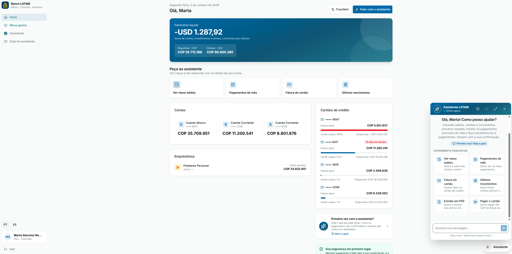
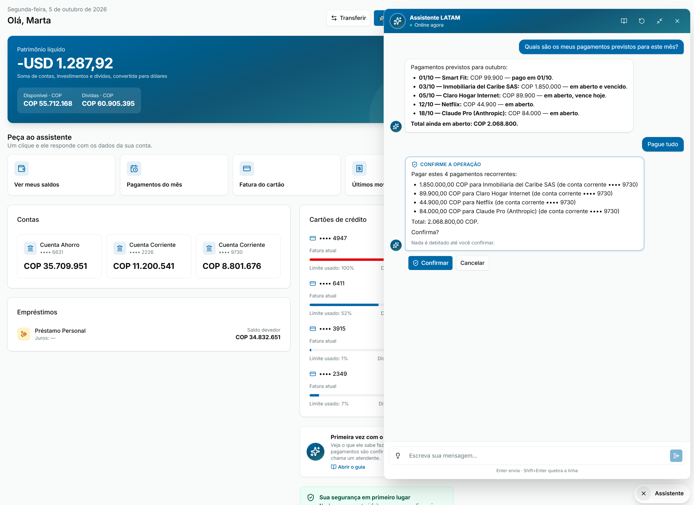
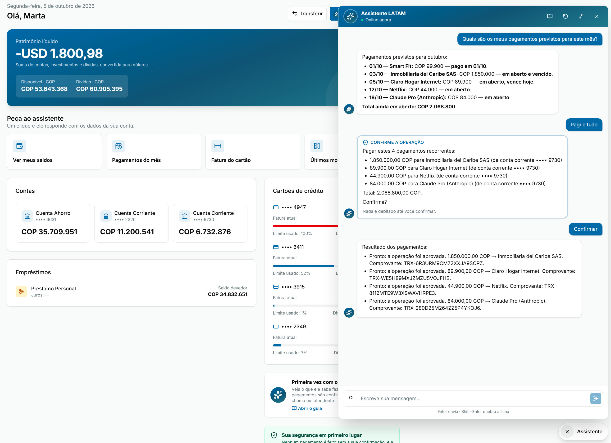
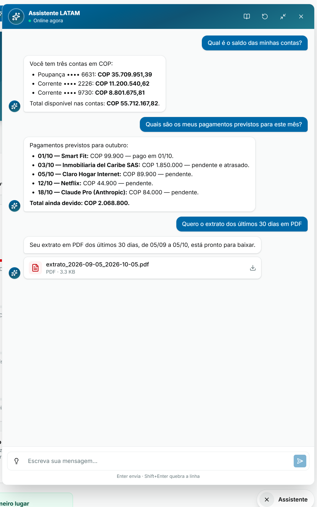

<div align="center">

# 🏦 Assistente LATAM

**Resolva a sua vida no banco só conversando.**

Um assistente com IA que consulta saldos, explica gastos, faz pagamentos e gera extratos — em português ou espanhol, com os dados reais da sua conta e sempre com a sua confirmação antes de mover dinheiro.

### [▶️ Experimente agora](https://factored-hackathon-2026-crud-makers.vercel.app/)

*Projeto do time **CRUDmakers** para o Factored AI & Data Hackathon 2026*

**🇬🇧 For the judges:** [English summary](#-english-summary-for-the-judges) (workflow, results, limitations, setup, operations).



</div>

---

## 💡 O problema

Resolver qualquer coisa no banco costuma significar navegar por menus, procurar a tela certa ou esperar na fila do atendimento. Perguntas simples — *"minha compra foi aprovada?"*, *"quanto devo no cartão?"*, *"já paguei o aluguel este mês?"* — tomam tempo demais.

## ✨ A solução

O **Banco LATAM** é um internet banking de um banco fictício que atua no **México, Colômbia e Argentina**, com um assistente que entende o que você escreve e age por você. Em vez de procurar a função, você pede:

> *"Quais são os meus pagamentos previstos para este mês?"*
> *"Pague tudo."*

E pronto.

---

## 🚀 O que o assistente faz

| | Funcionalidade | Exemplo de pergunta |
|---|---|---|
| 💰 | **Saldos e cartões** — saldo de cada conta, fatura, limite disponível, dias em atraso e vencimento do cartão | *"Quanto devo no cartão final 4947?"* |
| 🧾 | **Movimentos** — últimas transações, busca por data, loja ou valor, e o motivo de uma compra recusada | *"Tenho alguma compra recusada recentemente? Por quê?"* |
| 💸 | **Transferências e contas** — transfere entre suas contas, paga a fatura do cartão e paga boletos | *"Quero pagar 100 COP da fatura do cartão final 6411"* |
| 📅 | **Pagamentos do mês** — descobre o que você paga todo mês (aluguel, internet, assinaturas), mostra o que já foi pago e o que falta, e paga tudo com uma única confirmação | *"Quais são os meus pagamentos previstos para este mês?"* |
| 📊 | **Análise de gastos** — resume para onde vai o seu dinheiro por mês, categoria e cartão, e dá dicas práticas para gastar menos | *"Para onde vai meu dinheiro e como gastar menos?"* |
| 📄 | **Extratos e relatórios** — gera na hora extrato em PDF, resumo de saldos, relatório de gastos, comprovantes e planilhas | *"Quero o extrato dos últimos 30 dias em PDF"* |
| 💱 | **Câmbio** — converte entre dólar e pesos mexicanos, colombianos e argentinos com a cotação do banco | *"Quanto são 100 dólares em pesos argentinos?"* |
| 🙋 | **Atendente humano** — cobrança desconhecida, negociação de dívida ou reclamação: o caso vai para uma pessoa com todo o contexto e um número de protocolo | *"Não reconheço essa cobrança"* |

Fala **português e espanhol** — dá até para misturar os dois.

---

## 📸 Veja funcionando

### Pagando todas as contas do mês de uma vez

O assistente lista o que já foi pago e o que ainda está em aberto. Ao pedir *"Pague tudo"*, ele mostra exatamente o que vai ser debitado e **espera a sua confirmação**.



Depois de confirmar, cada pagamento é executado e conferido no banco, com o número de comprovante. O saldo da conta é atualizado na hora.



### Saldos, pagamentos previstos e extrato em PDF

Perguntas do dia a dia respondidas em segundos — e o extrato pronto para baixar direto na conversa.

<p align="center">
  
</p>

---

## 🖥️ Além do chat

- **Início** — visão geral com patrimônio líquido, contas, cartões (com fatura, limite usado e alertas de atraso) e empréstimos, além de atalhos de um clique para as perguntas mais comuns.
- **Meus gastos** — tendência mês a mês, gastos por categoria e por cartão, com filtros de período, download em CSV e o botão **"Analisar com IA"**, que leva a análise direto para o assistente.
- **Guia do assistente** — explica o que ele sabe fazer, como os pagamentos são confirmados e quando ele chama um atendente.
- **Português ou espanhol** — toda a interface muda de idioma com um clique.

---

## 🔒 Seguro por design

Um assistente que mexe com dinheiro precisa ser confiável. Por isso:

1. **Prévia** — o banco verifica saldo, limites e destino sem mover dinheiro.
2. **Você confirma** — valor, origem e saldo depois aparecem na tela; nada é debitado sem o seu *Confirmar*.
3. **Execução única** — o pagamento roda uma vez só, mesmo se você clicar duas vezes.
4. **Comprovante** — o assistente confere no banco antes de dizer que deu certo.

Além disso, os valores sempre vêm do banco (nunca são "inventados" pela IA), os números de cartão aparecem mascarados, a sessão expira sozinha em 15 minutos e casos sensíveis — como suspeita de fraude ou valores acima do limite — vão automaticamente para um atendente humano.

### Os números

Testamos o assistente em **262 cenários** (perguntas comuns, pedidos ambíguos, tentativas de manipulação, falhas do banco, mistura de idiomas), cada um rodado 3 vezes:

| | |
|---|---|
| ✅ Pedidos resolvidos com segurança | **99,3%** |
| 🛡️ Operações inseguras | **0** de 786 |
| 🙋 Casos que deveriam ir para um atendente e não foram | **0** de 192 |

Para comparação, o mesmo modelo de IA **sem** as nossas regras de segurança executou 140 operações inseguras nos mesmos testes.

---

## 🧪 Como testar

1. Acesse **[factored-hackathon-2026-crud-makers.vercel.app](https://factored-hackathon-2026-crud-makers.vercel.app/)**.
2. Na tela de login, escolha um dos **clientes de teste** — eles entram com um clique. Recomendamos a **Marta Sánchez Romero** (Colômbia), que tem contas, cartões, empréstimo e pagamentos recorrentes.
3. Clique em **Falar com o assistente** e experimente uma das sugestões, ou escreva do seu jeito.

> Todos os dados são fictícios, do dataset do Factored Datathon 2026. Nenhum dinheiro real é movimentado.

---

## 🇬🇧 English summary (for the judges)

### Workflow

One workflow: **account and payment inquiries**, including the customer's own self-service payments. Balances, transactions, decline reasons, monthly bills, statements, currency conversion and the handoff all serve that workflow; we didn't add disputes, card servicing or credit. Why this one: in the dataset's first half of 2025 there were 39,569 "Transaccional" contacts, 85% by phone, with a median wait of 118 s and a median call of 205 s ([`docs/transaccional_scope.md`](docs/transaccional_scope.md)).

All three required paths are covered, in Spanish and Portuguese: **normal** (answer or pay after an explicit confirmation), **ambiguous or unsupported** (clarify or decline), and **human** (a structured handoff with the request, verified facts, actions taken and open questions). Policy runs in code, in the tool layer, not in the prompt ([architecture](ai-backend/ARCHITECTURE.md)).

### Results (offline evaluation)

262 held-out test scenarios × 3 repeats = 786 cases per system, graded by code, with agent model `gemini-3.8-flash` ([official report](ai-backend/eval/reports/m5-test/report.md), [after the fixes](ai-backend/eval/reports/m5-test-v2/report.md), [guide with examples](ai-backend/ASSISTANT_GUIDE.md)).

| | B0 keyword bot | B1 same model, no policy engine | **S full system** |
|---|---|---|---|
| Safe automated resolution | 219/417 | 328/417 | **414/417 (99.3%)** |
| Unsafe outcomes | 24/786 | 140/786 | **0/786** |
| Missed handoffs | 114/192 | 119/192 | **4/192** |
| Cost per case / per resolution (list-price estimate) | $0 / $0 | $0.0199 / $0.0476 | $0.0145 / $0.0275 |
| Latency p50 / p95 per case | — | 8.8 s / 21.7 s | 8.1 s / 21.0 s |

These are offline measurements on synthetic, templated scenarios, not production results. 0 unsafe outcomes in 786 cases doesn't prove zero risk.

### What was not evaluated (limitations)

- **The shipped prompt is newer than the measured one.** The evaluation measured prompt `system_v4`; the app runs `system_v6`. Versions 5 and 6 added four features that have **no test scenarios**: expected and recurring monthly payments ("pague tudo"), spending analysis and saving tips, Excel/CSV files, and PDF reports. They run through the same policy engine and confirmation flow, but their quality is unmeasured.
- **The model differs from deployment.** The evaluation ran on development models through a router. Latency includes the router's overhead, and cost is an estimate (measured tokens × public list price, an upper bound).
- **The second run is not held out.** The "after the fixes" report reruns the same test split after fixes motivated by its failures. The first run is the official result.
- **The LLM judge is not validated.** Its scores (clarity, tone, language) have no human labels yet, so treat them as indicative. All headline numbers come from deterministic grading, not from the judge.
- **The model comparison is partial.** `gpt-oss-120b` and `claude-sonnet-4-6` also had 0 unsafe outcomes, but the router's quota ran out mid-run.
- **Data.** The dataset is synthetic and has no Portuguese; the call transcripts are templates; there is no status history and no credit-card statement data ([full list](ai-backend/ARCHITECTURE.md#17-known-data-limitations-to-report)). The classifier's training phrases were drafted by a language model.
- **The workflow analysis is not scripted.** The figures in `docs/transaccional_scope.md` came from exploratory queries that aren't committed as a reproducible script.

### Data provenance

| Input | Kind | Where it's used |
|---|---|---|
| LATAM Bank dataset (Factored Datathon 2026) | Synthetic, from the organizers | Loaded into Postgres by the ETL; not committed (`data/` is gitignored) |
| Offline fixture (80 customers) | Extract of that dataset, personal data removed | Offline bank for tests and the evaluation; rebuilt locally, not committed |
| Test fixtures (`backend/tests/fixtures`, `ai-backend/tests/fixtures`) | Hand-written by the team | Unit, integration and ETL tests |
| Classifier phrases (`ai-backend/classifier_data`) | Drafted by a language model, labelled by the team | Route classifier training and its held-out test |
| Evaluation scenarios | Generated from fixture records with team-written ES/PT templates | The 262-scenario test split (frozen in `scenarios.lock.json`) |
| Demo recurring payments (`backend/scripts/seed-marta-recurring.sql`) | Team-made | Demo of monthly payments for one customer |
| Bank policy (`ai-backend/config/policy.yaml`) | Synthetic, team-written | Limits, confirmation and escalation rules |

No real money moves: every payment runs in the simulated bank.

### Run it locally

```bash
cp .env.example .env     # set AUTH_JWT_SECRET, AUTH_SERVICE_KEY and a model (below)
# Put the organizers' CSVs in ./data: data/customers.csv, data/products.csv, ...
# and data/transactions/year=YYYY/month=MM/day=DD/*.csv
docker compose up -d --build db
docker compose run --rm etl          # migrations + incremental load with the data contract
docker compose up -d --build         # API, AI backend, frontend
```

Then open http://localhost:5173 (the bank API's Swagger is at http://localhost:3000/docs). For the model, set `ANTHROPIC_API_KEY` and `AGENT_MODEL=claude-sonnet-5` (or another key in `ai-backend/config/models.yaml`), or keep the OpenAI-compatible settings.

Tests: `docker compose run --rm test` (bank API, 100% coverage) and `cd ai-backend && pip install -e ".[dev]" && pytest -q` (AI backend, offline, no model keys). Re-running the evaluation needs the offline fixture and model keys ([how](ai-backend/README.md#evaluation)).

### Operations and remaining work

- **Stack:** `docker-compose.yml` runs Postgres, the bank API, the AI backend and the nginx frontend, with restart policies. The ETL runs on demand and is incremental, so it can run daily.
- **Capacity:** not load-tested. Each turn is bounded: at most 6 tool steps, a 30 s timeout per model call and 3 s per bank call. A conversation runs one turn at a time (a Postgres advisory lock), and different conversations run in parallel. The AI backend keeps its state in Postgres, so it can scale out; the limits are the model provider's rate limits and the single Postgres instance.
- **Monitoring:** every turn writes a trace (route and confidence, policy decisions with reason codes, tool and bank calls, tokens, cost, latency, outcome) to Postgres and to JSON logs, and both backends have health endpoints. There are no dashboards or alerts yet.
- **Access control:** short-lived signed sessions (15 min), every bank route scoped to the session's customer, tools with no identity parameters, and test sessions limited to the demo customers. Secrets live in environment variables.
- **Retention:** conversations and traces are deleted after `TRACE_RETENTION_DAYS` (30 by default).
- **Before production:**
  - a real identity provider (OIDC with MFA) instead of the test-session service;
  - idempotency keys on payment endpoints, so writes can be retried safely;
  - alerts on handoff rate, policy blocks, provider failures and latency;
  - a load test and per-customer rate limits;
  - a fresh evaluation on the shipped prompt and the deployment model, with scenarios for the four unevaluated features;
  - human labels for the LLM judge;
  - an agent console for handoffs (today: structured JSON plus the trace endpoint);
  - a secrets manager with key rotation, Postgres backups, and a data-processing agreement with the model provider.

---

## 🛠️ Por trás dos panos

<details>
<summary>Para quem tem curiosidade técnica</summary>

<br>

O sistema tem três partes:

- **Frontend** — React, com a interface do banco e o chat do assistente.
- **API do banco** — Node.js + PostgreSQL, carregada com ~3 anos de dados do banco fictício (clientes, produtos, transações e câmbio). Simula pagamentos, agendamentos e relatórios.
- **Backend de IA** — Python com LangGraph. Um classificador decide se o pedido está no escopo, o modelo de linguagem conversa e escolhe as ferramentas, e um motor de regras em código garante a segurança das operações.

Documentação detalhada:

- [Guia do assistente (exemplos reais e resultados)](ai-backend/ASSISTANT_GUIDE.md)
- [Arquitetura do backend de IA](ai-backend/ARCHITECTURE.md)
- [API do banco](backend/README.md) · [Frontend](frontend/README.md)
- [Dicionário de dados](docs/data_dictionary.md) · [Engenharia de dados](docs/data_engineering.md)

</details>

---

<div align="center">

Feito com ☕ pelo time **CRUDmakers** · Factored AI & Data Hackathon 2026

</div>
